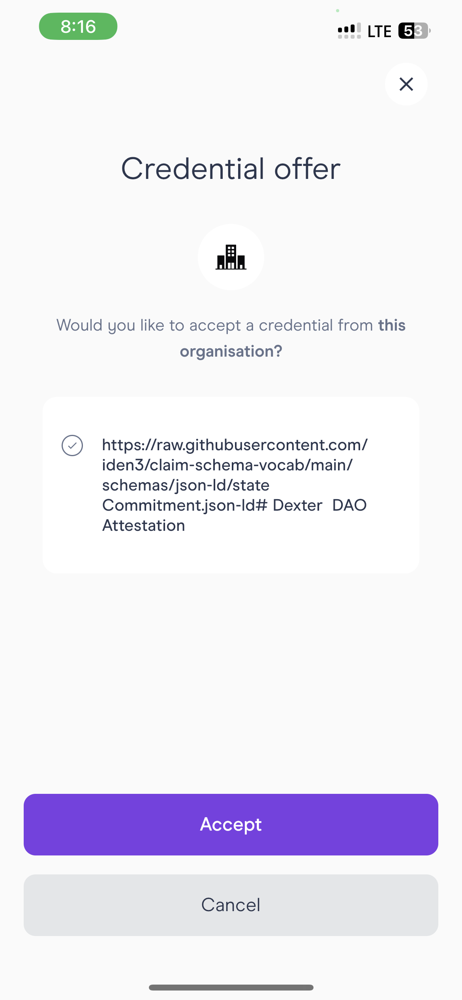

# Wallet

## Screenshots

 

 

 

## Contracts

Arora proxy: 0x1d58b1FCB991fA0116fEc4dE2340F0d5A92143FB
impl: 0x5967BcFfA5a2C13dF5A76AFad0c6191d7347D971

Metis Main 0x06c69FA0E25dEDe0D25865FA795448fa4851DFb9
proxy 0x5967BcFfA5a2C13dF5A76AFad0c6191d7347D971

Neon Main 0x06c69FA0E25dEDe0D25865FA795448fa4851DFb9
proxy 0x5967BcFfA5a2C13dF5A76AFad0c6191d7347D971\

## Link to modified fork of issuer node

https://github.com/Dext0rs/issuer-node
