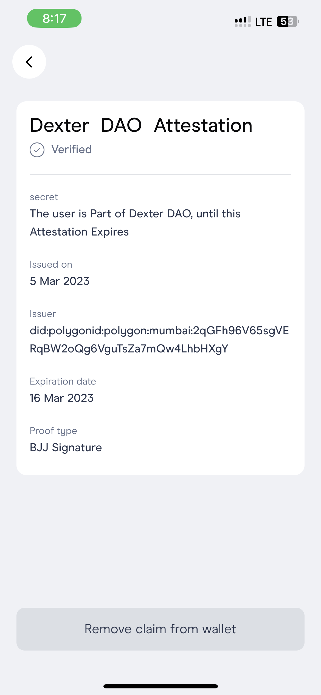
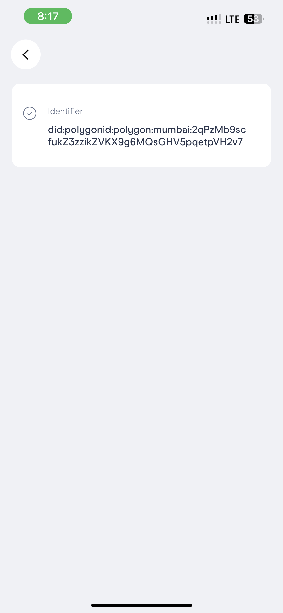

# DextOrs

DextOrs is a unique combination of Polygon ID and Optimism's AttestationStation. Polygon ID's issuer issues DID which once claimed is pushed to forks of Optimism's AttestationsStation deployed on all the networks using modified version of PolygonID's issuer node.

## Contracts

Optimism:  
impl: `0xbeD744818e96AAD8a51324291a6f6Cb20A0c22be`  
proxy: `0xEE36eaaD94d1Cc1d0eccaDb55C38bFfB6Be06C77`

Arora:  
impl: `0x5967BcFfA5a2C13dF5A76AFad0c6191d7347D971` 
proxy: `0x1d58b1FCB991fA0116fEc4dE2340F0d5A92143FB`

Metis: 
impl: `0x06c69FA0E25dEDe0D25865FA795448fa4851DFb9` 
proxy: `0x5967BcFfA5a2C13dF5A76AFad0c6191d7347D971`

Neon: 
impl: `0x06c69FA0E25dEDe0D25865FA795448fa4851DFb9` 
proxy: `0x5967BcFfA5a2C13dF5A76AFad0c6191d7347D971`

## Link to modified fork of issuer node

https://github.com/Dext0rs/issuer-node

## Screenshots (Wallet)

 | 

 | 

 | 

## Screenshots (AttestatonStation)

